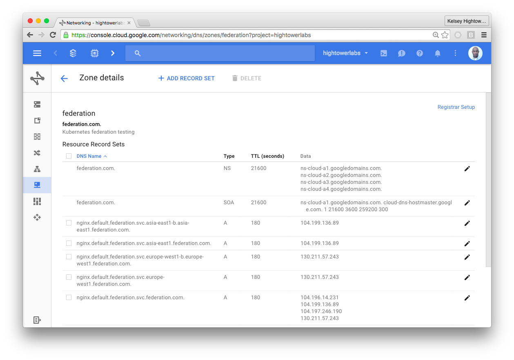

# Federated Kubernetes Tutorial

This guide will walk you through testing the upcoming support for cluster federation in Kubernetes 1.3. This guide will cover the cross-cluster load balancing and service discovery features as documented in the [Kubernetes Cluster Federation aka Ubernetes design doc](https://github.com/kubernetes/kubernetes/blob/release-1.3/docs/design/federated-services.md) 

## Prerequisites

Frist checkout this repostory which contains the Kubernetes configs required to build the federated control plane.

```
git clone https://github.com/kelseyhightower/kubernetes-cluster-federation.git
cd kubernetes-cluster-federation
```

Next complete each of the following tasks in order.

* [Provision Kubernetes Clusters](labs/cluster-bootstrap.md)
* [Create Cluster Secrets and Manifests](labs/create-cluster-secrets-and-manifests.md)
* [Create GCE DNS Managed Zone](labs/cluster-dns-managed-zone.md)

## Provision Federated Control Plane

The Kubernetes federated control plane consists of two services:

* federation-apiserver
* federation-controller-manager

Both services need to run in a host Kubernetes cluster. Use the gce-us-central1 clusters as the host cluster.

```
kubectl config use-context gke_hightowerlabs_us-central1-b_gce-us-central1
```

### Federation Namespace

The Kubernetes federation control plane will run in the federation namespace. Create the federation namespace using kubectl:

```
kubectl create -f ns/federation.yaml
```

### Federated API Server Service

The federated controller manager must be able to locate the federated API server when running on the host cluster.

```
kubectl create -f services/federation-apiserver.yaml
```

Wait until the `EXTERNAL-IP` is populated as it will be required to configure the federation-controller-manager.

```
kubectl --namespace=federation get services 
```
```
NAME                   CLUSTER-IP      EXTERNAL-IP    PORT(S)   AGE
federation-apiserver   10.119.242.80   XX.XXX.XX.XX   443/TCP   1m
```

### Federation API Server Secret

In this section you will create a set of credentials to limit access to the federated API server.

Edit known-tokens.csv to add a token to the first column of the first line. This token will be used to authenticate Kubernetes clients.

```
XXXXXXXXXXXXXXXXXXX,admin,admin
```

#### Create the federation-apiserver-secrets

Store the `known-tokens.csv` file in a Kubernetes secret that will be accessed by the federated API server at deployment time.

```
kubectl --namespace=federation \
  create secret generic federation-apiserver-secrets \
  --from-file=known-tokens.csv
```

```
kubectl --namespace=federation \
  describe secrets federation-apiserver-secrets
```

### Federation API Server Deployment

Get the federated API server public IP address.

```
advertiseAddress=$(kubectl --namespace=federation get services federation-apiserver \
  -o jsonpath='{.status.loadBalancer.ingress[0].ip}')
```

Edit `deployments/federation-apiserver.yaml` and set the advertise address for the federated API server.

```
sed -i "" "s|ADVERTISE_ADDRESS|${advertiseAddress}|g" deployments/federation-apiserver.yaml
```

Create the federated API server in the host cluster:

```
kubectl create -f deployments/federation-apiserver.yaml
```

#### Verify

```
kubectl --namespace=federation get deployments
```
```
NAME                   DESIRED   CURRENT   UP-TO-DATE   AVAILABLE   AGE
federation-apiserver   1         1         1            0           7s
kubernetes-cluster-federation $ kubectl --namespace=federation get pods
```

```
kubectl --namespace=federation get pods
```
```
NAME                                   READY     STATUS    RESTARTS   AGE
federation-apiserver-116423504-4mwe8   2/2       Running   0          13s
```

### Federation Controller Manager Deployment

#### Create the Federated API Server Kubeconfig

The federation-controller-manager needs a kubeconfig file to connect to the federation-apiserver.

Get the federated API server public IP address:

```
advertiseAddress=$(kubectl --namespace=federation get services federation-apiserver \
  -o jsonpath='{.status.loadBalancer.ingress[0].ip}')
```

Use the `kubectl config` command to build up a kubeconfig file for the federated API server:

```
kubectl config set-cluster federation-cluster \
  --server=https://${advertiseAddress} \
  --insecure-skip-tls-verify=true
```

```
kubectl config set-credentials federation-cluster \
  --token=changeme
```

```
kubectl config set-context federation-cluster \
  --cluster=federation-cluster \
  --user=federation-cluster
```

Switch to the `federation-cluster` context and dump the federated API server credentials:

```
kubectl config use-context federation-cluster
```

```
kubectl config view --flatten --minify > kubeconfigs/federation-apiserver/kubeconfig
```

#### Create the Federated API Server Secret

Switch to the host cluster context and create the `federation-apiserver-secret`, which holds the kubeconfig for the federated API server used by the Federated Controller Manager.

```
kubectl config use-context gke_hightowerlabs_us-central1-b_gce-us-central1
```

```
kubectl create secret generic federation-apiserver-secret \
  --namespace=federation \
  --from-file=kubeconfigs/federation-apiserver/kubeconfig
```

Verify

```
kubectl --namespace=federation describe secrets federation-apiserver-secret
```

### Deploy the Federated Controller Manager

```
kubectl create -f deployments/federation-controller-manager.yaml
```

Wait for the `federation-controller-manager` pod to be running.

```
kubectl --namespace=federation get pods
```

```
NAME                                             READY     STATUS    RESTARTS   AGE
federation-apiserver-116423504-4mwe8             2/2       Running   0          12m
federation-controller-manager-1899587413-c1c1w   1/1       Running   0          16s
```

## Adding Clusters

With the federated control plane in place we are ready to start adding clusters to our federation.

### gce-asia-east1

```
kubectl --namespace=federation create secret generic gce-asia-east1 \
  --from-file=kubeconfigs/gce-asia-east1/kubeconfig
```

```
kubectl --context=federation-cluster \
  create -f clusters/gce-asia-east1.yaml
```

### gce-europe-west1

```
kubectl --namespace=federation create secret generic gce-europe-west1 \
  --from-file=kubeconfigs/gce-europe-west1/kubeconfig
```

```
kubectl --context=federation-cluster \
  create -f clusters/gce-europe-west1.yaml
```

### gce-us-central1

```
kubectl --namespace=federation create secret generic gce-us-central1 \
  --from-file=kubeconfigs/gce-us-central1/kubeconfig
```

```
kubectl --context=federation-cluster \
  create -f clusters/gce-us-central1.yaml
```

### gce-us-east1

```
kubectl --namespace=federation create secret generic gce-us-east1 \
  --from-file=kubeconfigs/gce-us-east1/kubeconfig
```

```
kubectl --context=federation-cluster \
  create -f clusters/gce-us-east1.yaml
```

### Verify

```
kubectl --context=federation-cluster get clusters
```
```
NAME               STATUS    VERSION   AGE
gce-asia-east1     Ready               1m
gce-europe-west1   Ready               57s
gce-us-central1    Ready               47s
gce-us-east1       Ready               34s
```

## Running Federated Workloads

Create a federated service object in the `federation-cluster` context.

```
kubectl --context=federation-cluster create -f services/nginx.yaml
```

```
kubectl --context=federation-cluster describe services nginx
```

### Create Nginx Deployments

```
kubectl --context="gke_hightowerlabs_asia-east1-b_gce-asia-east1" \
  run nginx --image=nginx:1.11.1-alpine --port=80
```

```
kubectl --context="gke_hightowerlabs_europe-west1-b_gce-europe-west1" \
  run nginx --image=nginx:1.11.1-alpine --port=80
```

```
kubectl --context=gke_hightowerlabs_us-central1-b_gce-us-central1 \
  run nginx --image=nginx:1.11.1-alpine --port=80
```

```
kubectl --context="gke_hightowerlabs_us-east1-b_gce-us-east1" \
  run nginx --image=nginx:1.11.1-alpine --port=80
```

### Review Cloud DNS Console

The Federated controller manager creates DNS entires in the configured zone.



## Cleanup

### DNS Managed Zone

The managed zone must be empty before you can delete it. Visit the Cloud DNS console and delete all resource records before running the following command:

```
gcloud dns managed-zones delete federation
```

### Kubernetes Objects

```
kubectl delete pods,svc,rc,deployment,secret --namespace=federation --all
```

### GKE Clusters

Delete the 4 GKE clusters.

```
gcloud container clusters delete gce-asia-east1 --zone=asia-east1-b
gcloud container clusters delete gce-europe-west1 --zone=europe-west1-b
gcloud container clusters delete gce-us-central1 --zone=us-central1-b
gcloud container clusters delete gce-us-east1 --zone=us-east1-b
```
